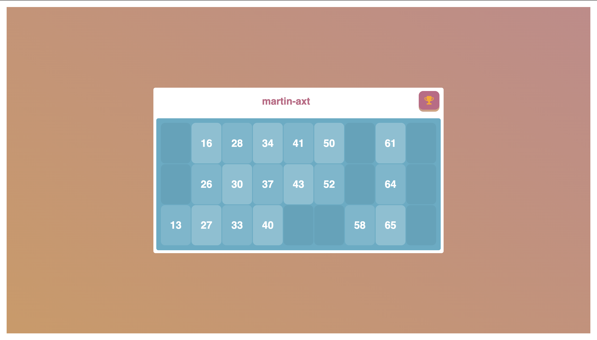

# Bingo
Bingo game to play online while the quarantine of 2020. This project consist in a Flask based web where every user is given a random card to play via a instagram direct or similar.

# Requirements
1. [Pip](https://pypi.org/project/pip/)
2. [Virtualenv](https://virtualenv.pypa.io/en/stable/)
3. [Git](https://git-scm.com)
4. [Gunicorn](https://gunicorn.org/)

# Installation
1. Clone the repo with `git clone https://github.com/martin-axt/Bingo.git`
2. Change directory `cd Bingo`
3. Create a virtual environment `virtualenv venv`
4. Activate the virtual environment `source ./venv/bin/activate`
5. Install Flask with pip `pip install Flask`
6. Run the server `gunicorn -b 0.0.0.0:8080 -w 4 app:app`

